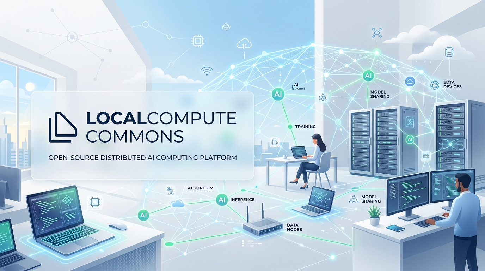

# 🚀 LinkedIn Announcement Post: LocalCompute Commons



---

### 📝 Copy-Paste Ready LinkedIn Post

```text
🚀 Excited to open-source LocalCompute Commons: A Secure, Distributed Local-AI Compute-Sharing Platform for Colleges, Labs & NGOs! 🌐⚡

💡 The Problem:
Students, small research labs, non-profits, and rural institutions often have dozens of idle laptops, desktops, and lab workstations, yet cannot afford costly cloud GPU rentals. Even worse, handling sensitive institutional datasets means uploading raw documents to third-party proprietary clouds is a major privacy and compliance violation.

🛠️ The Solution: LocalCompute Commons
LocalCompute Commons aggregates fragmented campus and community hardware into a secure, private, zero-cloud compute mesh that executes AI batch workloads locally with Ollama!

Key Architectural & Technical Highlights:
🔹 Deterministic Policy Scheduler: Multi-factor scoring function balancing CPU/VRAM resource fitness, model cache locality, AC power stability, battery thresholds, and load balancing — with explainable scheduling factor breakdowns!
🔹 Zero-Retention Privacy Classes: Support for `local_only`, `trusted_nodes`, and `standard` perimeters with automated in-flight Bearer token and PII redaction.
🔹 Fault-Tolerant Lease Recovery: 60-second time-bounded worker leases with automated recovery daemons that detect node disconnections (<30s) and safely re-queue orphaned tasks with zero duplicate executions.
🔹 10 Official Model Context Protocol (MCP) Tools: Integrated with the official Python MCP SDK for seamless AI agent orchestration, administrative approvals, and capacity inspection.
🔹 Multi-Party Authorization Gatekeeper: High-impact actions (node revocation, extended maintenance pause, bulk cancellations) require explicit operator approval.
🔹 Carbon & Renewable-Aware Scheduling: Dynamically awards scheduling bonuses to nodes operating on solar or low-carbon intensity grid windows.
🔹 Modern React 18 Control Dashboard: Real-time compute utilization gauges (CPU, RAM, VRAM), parallel task Gantt timeline, and cryptographic SHA-256 audit trail viewer.
🔹 n8n Hourly Health Automation: Autonomous hourly capacity snapshots and instant incident alerting.

📊 Benchmark Validation (40 Reproducible Scenarios):
✅ 100.0% Scheduling Policy Correctness
✅ 100.0% Task Batch Completion Rate
✅ 0.12s Average Worker Failure Recovery
✅ 0.0% Duplicate Execution Rate
✅ 15.4ms P95 Scheduler Latency

💻 Tech Stack:
Python 3.11 • FastAPI • React 18 • TypeScript • Tailwind CSS • SQLAlchemy • PostgreSQL • Redis • Ollama • Docker Compose • MCP SDK • Prometheus • n8n • Pytest • Playwright

🔗 Explore the Code & Deploy Locally:
GitHub Repository: https://github.com/vijaymahes9080/LocalCompute-Commons

Let’s democratize access to AI compute for researchers and students everywhere! Feedback, PRs, and stars are warmly welcome. ⭐

#OpenSource #ArtificialIntelligence #DistributedSystems #LocalLLM #Ollama #Python #FastAPI #ReactJS #ModelContextProtocol #EdgeAI #GreenComputing #CloudComputing #DevOps
```
