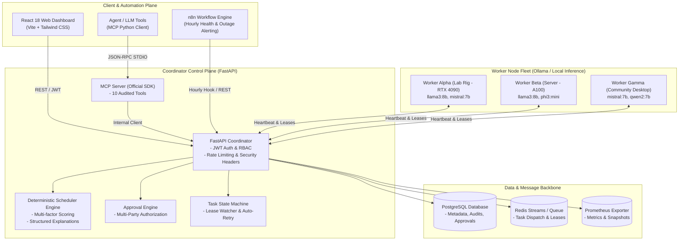

# LocalCompute Commons 🌐⚡

[](https://github.com/vijaymahes9080/LocalCompute-Commons/actions/workflows/ci.yml)
[](LICENSE)
[](https://www.python.org/)
[](https://reactjs.org/)
[](https://modelcontextprotocol.io/)

> **Secure, Privacy-Preserving Distributed Local-AI Compute-Sharing Platform for Colleges, NGOs, Research Groups, and Community Labs.**

---

## 🎯 Mission & Problem Statement

Students, small research laboratories, non-profits, and rural institutions often have dozens of idle laptops, desktop workstations, and lab PCs, yet cannot afford costly cloud GPU rentals or are legally prohibited from uploading sensitive documents to proprietary cloud APIs.

**LocalCompute Commons** turns fragmented campus and community computers into an auditable, encrypted, private compute mesh. It schedules privacy-aware batch AI workloads (such as Ollama text summarization), executes them across local nodes, recovers automatically from worker disconnections, exposes verified Model Context Protocol (MCP) tools, and provides deterministic, explainable scheduling decisions.

---

## 🏗️ System Architecture



---

## ✨ Key Features

1. **Deterministic Multi-Factor Scheduler**:
   - Scores worker candidates using resource fit, model cache locality, AC/battery state, network quality, active load, and clock skew.
   - Outputs verifiable, human-readable explanations with every scheduling decision.
   - **Zero stochastic LLM bypass**: The agent cannot override hard safety constraints.

2. **Zero-Retention Privacy Classes**:
   - `local_only`: Tasks never leave the submitting node or air-gapped machine.
   - `trusted_nodes`: Dispatched exclusively to verified university / lab hardware.
   - `standard`: Dispatched to community nodes with automated Bearer token and PII redaction.

3. **Fault Tolerance & Lease Recovery**:
   - 60-second time-bounded worker leases.
   - Automated detection of dead/disconnected nodes (>30s missed heartbeats).
   - Idempotent non-duplicate task re-queueing with exponential backoff up to retry limits.

4. **10 Official Model Context Protocol (MCP) Tools**:
   - `list_available_nodes`, `inspect_node_capabilities`, `submit_workload`, `get_job_status`, `get_task_status`, `rebalance_job`, `pause_node`, `revoke_node`, `generate_capacity_report`, `get_audit_events`.

5. **Administrative Multi-Party Authorization**:
   - Node revocation, extended pauses (>60 min), and bulk cancellations require explicit operator approval.

6. **Rich React 18 Control Dashboard**:
   - Real-time compute utilization gauges (CPU, RAM, VRAM).
   - Worker inventory with battery and power telemetry.
   - Batch job progress viewer, task attempt inspection, and scheduling factor radar breakdown.
   - Audit trail viewer with cryptographic SHA-256 event hash proofs.

7. **n8n Automation Workflow**:
   - Hourly capacity snapshots and automated alert creation upon node outages or high queue latency.

8. **Carbon & Renewable Energy Aware Scheduling**:
   - Integrates real-time grid carbon intensity metrics (gCO2/kWh) and solar peak forecasts to award scheduling bonuses to green energy compute nodes.

9. **6-Digit PIN & QR Mutual Pairing Handshake**:
   - One-time cryptographic pairing tokens and QR payloads for instant onboarding of student laptops.

10. **Federated Semantic Embedding Engine**:
    - Generates local dense vector embeddings with differential privacy Laplace noise injection ($\epsilon=1.0$) for decentralized semantic search without raw document sharing.

11. **Multi-Tenant Campus Dominant Resource Fairness (DRF)**:
    - Fair-share quota allocator preventing compute slot starvation across college departments, student clubs, and labs.

12. **Interactive Terminal CLI (`lc`) & Live Gantt Timeline**:
    - Full-featured command-line interface (`python packages/cli/cli.py`) and live task progress Gantt chart in the React dashboard.

---

## 🚀 Quick Start

### Option A: Local Zero-Dependency Run (Python + Vite)

1. **Install Dependencies**:
   ```bash
   pip install -r requirements.txt
   cd apps/web && npm install && cd ../..
   ```

2. **Start Coordinator**:
   ```bash
   uvicorn apps.coordinator.main:app --host 0.0.0.0 --port 8000 --reload
   ```

3. **Start Worker Nodes (Run in separate terminals)**:
   ```bash
   python examples/run_local_worker.py
   ```

4. **Start Web Dashboard**:
   ```bash
   cd apps/web && npm run dev
   ```
   Open `http://localhost:5173` (Demo credentials: `admin` / `AdminLocalCompute2026!`).

### Option B: Docker Compose (Full Cluster Deployment)

```bash
docker compose -f infra/docker/docker-compose.yml up -d --build
```
This boots PostgreSQL, Redis, Coordinator, 3 Worker Nodes, Web UI, MCP Server, Prometheus, and n8n.

---

## 🧪 Running Tests & 40-Scenario Evaluation

```bash
# 1. Run Unit & Integration Tests
pytest tests/ -v --cov=packages --cov=apps/coordinator --cov=services

# 2. Run 40-Scenario Evaluation & Benchmark Suite
python tests/evaluation/run_evaluations.py
```

---

## 📚 Documentation Index

- [Quick Start Guide](docs/QUICKSTART.md)
- [Architecture & State Machine](docs/ARCHITECTURE.md)
- [Deterministic Scheduling Policy](docs/SCHEDULING_POLICY.md)
- [Zero-Retention Privacy Model](docs/PRIVACY_MODEL.md)
- [Threat Model & STRIDE Analysis](docs/THREAT_MODEL.md)
- [MCP Tool Catalog](docs/MCP_CATALOG.md)
- [n8n Automation Setup](docs/N8N_SETUP.md)
- [Docker Deployment Guide](docs/DOCKER_DEPLOYMENT.md)
- [40-Scenario Evaluation Report](docs/EVALUATION_REPORT.md)
- [Operations Runbook](docs/OPERATIONS_RUNBOOK.md)
- [Responsible Use Guidelines](docs/RESPONSIBLE_USE.md)
- [Contributing Guidelines](docs/CONTRIBUTING.md)

---

## 🛡️ Security & Privacy Integrity

- **No Hardcoded Secrets**: Managed exclusively via `.env` and environment variables.
- **No Arbitrary Code Execution**: Tools cannot execute shell or OS commands.
- **Cryptographic Event Chaining**: Audit events computed with tamper-evident SHA-256 hashes.
- **Result Integrity**: HMAC-SHA256 signatures for worker task results.

---

## 📄 License

Distributed under the MIT License. See [LICENSE](LICENSE) for details.
