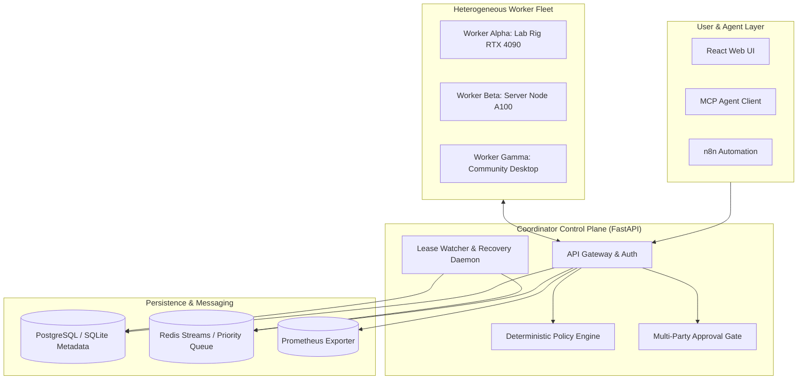
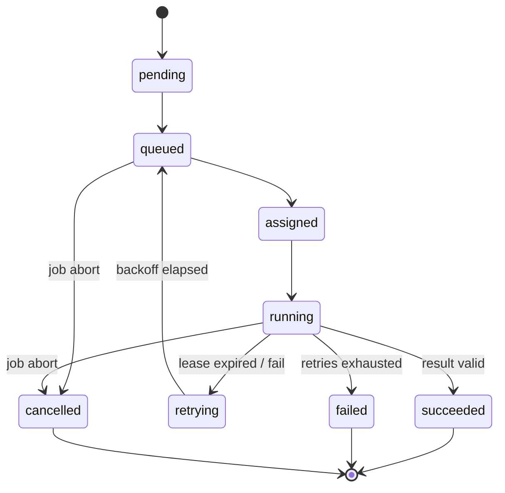

# System Architecture & Distributed State Machine

LocalCompute Commons coordinates decentralized compute nodes with deterministic scheduling, privacy-preserving placement, and fault-tolerant lease lifecycles.

---

## 1. System Topology

---

## 2. Job & Task State Machine

### Job Lifecycle States
- `pending`: Workload received, awaiting task decomposition and queue dispatch.
- `queued`: Tasks queued, waiting for worker lease claims.
- `assigned`: Tasks mapped to candidate workers.
- `running`: One or more tasks actively executing on worker hardware.
- `succeeded`: All batch tasks successfully completed and output aggregated.
- `failed`: One or more tasks reached terminal retry limit.
- `cancelled`: Manually aborted by user or administrator.
- `expired`: Workload exceeded maximum allowed execution runtime.

### Task State Transition Diagram

---

## 3. Worker Lease & Failure Recovery Protocol

1. **Heartbeat Protocol**: Workers emit telemetry every 5 seconds. Nodes with no heartbeat for $>30\text{s}$ are transitioned to `offline`.
2. **Time-Bounded Leases**: When a worker claims a task, a 60-second lease is recorded in PostgreSQL.
3. **Automated Recovery Loop**: An asynchronous recovery daemon scans for expired leases every 3 seconds.
4. **Idempotent Re-queueing**: Expired tasks have their `attempt_count` incremented. If `attempt_count < max_retries`, the task state is reset to `queued` for assignment to another healthy worker.
5. **Cryptographic Result Signing**: When a worker finishes inference, it computes a canonical SHA-256 checksum and HMAC signature over the output payload.
